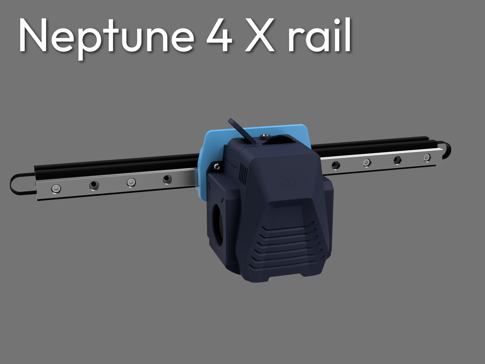

# Neptune 4 series X rail

Shield: [![CC BY-NC-SA 4.0][cc-by-nc-sa-shield]][cc-by-nc-sa]

This work is licensed under a
[Creative Commons Attribution-NonCommercial-ShareAlike 4.0 International License][cc-by-nc-sa].

[![CC BY-NC-SA 4.0][cc-by-nc-sa-image]][cc-by-nc-sa]

[cc-by-nc-sa]: http://creativecommons.org/licenses/by-nc-sa/4.0/
[cc-by-nc-sa-image]: https://licensebuttons.net/l/by-nc-sa/4.0/88x31.png
[cc-by-nc-sa-shield]: https://img.shields.io/badge/License-CC%20BY--NC--SA%204.0-lightgrey.svg

## Introduction

The design allows you to put a front mounted MGN12H linear rail on the neptune 4 series, currently it's in beta and highly experimental.

Earliest testing data yielded a 20% increase in recommended accel via input shaping(IS), with a reduction in vibrations and corner smoothing using nozzle adxl.

### Features
- Improved COM placement.
- Increased rigidity.
- Proper parallel belt path.
- Increase movement accuracy, toolhead rigidity.
- Lowers the gantry compared to toolhead -> z cable bracket no longer hitting tie rods.
- Retains most mod compatibility (cable chains, fan mods, etc).
### Cons:
- 8mm loss in Y axis compared to stock.
- Renders the aux fan null.
- Requires skill, hardware, and machine tuning.

🤩 Do you like the design? You can help fund innovations like this!

[Consider supporting me!](https://buymeacoffee.com/silencedfrost)

Much appreciation given to my supporters, and you get exclusive access to various CAD files!

Submit feature requests [here!](https://trello.com/b/vacGVoLQ/cad-modelling-requests)

## BOM (Only listing extra parts, no stock)

|Item                         |Amount|Recommended source      |
|-----------------------------|------|------------------------|
|MGN12H linear rail           |1     |Youmetong Z2            |
|EU profile aluminum extrusion|1     |                        |
|Gates gt2/edpm gt2 6mm belt  |1     |                        |
|Lithium grease               |      |Mobilux EP2/Mobil XHP222|
|Filament                     |      |PETG-GF/CF or ABS/ASA   |
|M3x35mm BHCS                 |2     |                        |
|M3x40mm BHCS                 |2     |                        |
|M3x16mm BHCS                 |4     |                        |
|M3x6mm FHCS                  |4     |                        |
|M3x10mm FHCS                 |1     |                        |
|M3 Hex/Square nut            |4     |                        |
|M4x8 BHCS                    |4     |                        |
|M4 T-nuts                    |4     |                        |
|M3x8mm SHCS                  |plenty|                        |
|M3 T-nuts                    |plenty|                        |
|M3 heat inserts (<4.7mm OD)  |4     |                        |
|10mm metal drillbit          |1     |                        |
|6900-2rs                     |1     |                        |

### Rail, extrusion, and belt lengths

|Model   |Rail       |Extrusion       |Belt  |
|--------|-----------|----------------|------|
|Base/pro|295mm-325mm|355mm           |820mm |
|Plus    |380mm-410mm|440mm           |1000mm|
|Max     |480mm-510mm|540mm           |1200mm|

### Note: get highest preload option the brand offers

## Print settings

STL wasn't accounted for shrinkage, compensate as needed.

### Minimum:
- 3 walls.
- 1 mm top-bottom.
### Recommended
- 5 walls.
- 1.6mm top-bottom.
- 0.2mm layer height.

# Assembly guide

## Inserting heatsets

## Drilling extrusion x2 (One hole for each end)

### Assembling drill guide tool

### Drilling the extrusion

Run at high rpm and feed the drillbit in slowly, or else it'll bite on the aluminum and you'll have a bad time! Hold the extrusion down tight.

There's no need to drill deeper than the first top flange.

